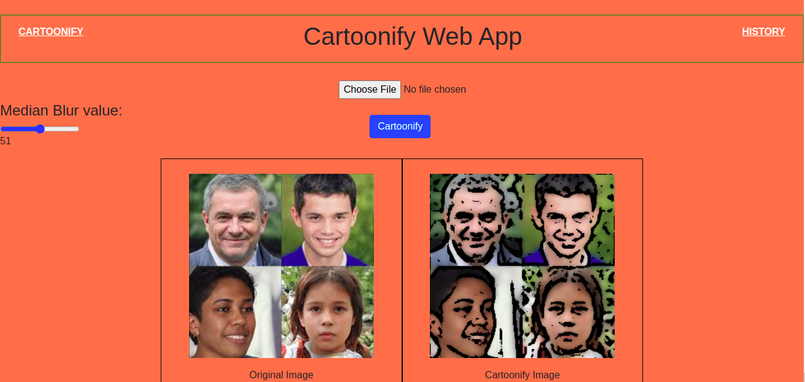
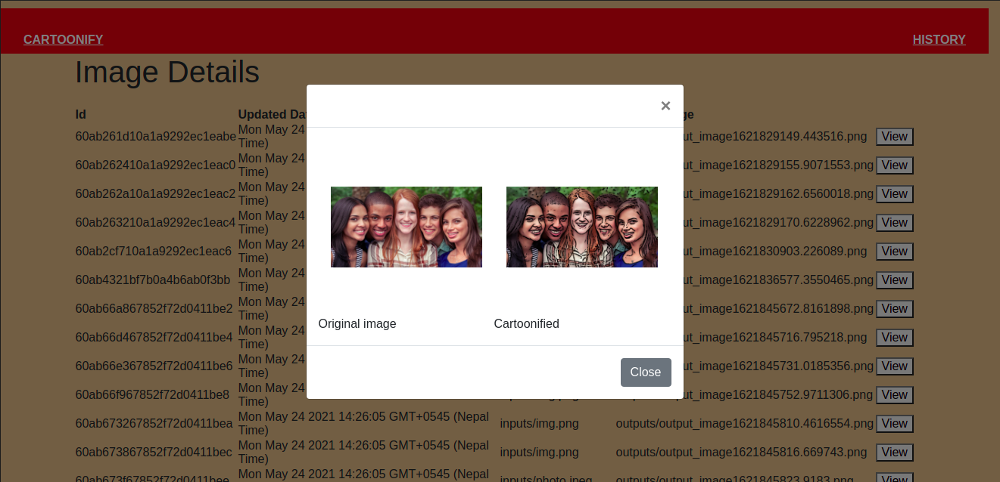

# Cartoonify Image WEB APP

**Project Description**

This is a full fledge web app for converting the original image to cartoon image.

The project consist of backend,Frontend and the database part and a python script for cartoonify image

Two page are there in app:

    1. Home page where original and cartoonify image will be display
    2. History page where information of data saved in dbms is shown and also pop up modal for viewing both image

*Frontend Technology used:*
1. [HTML](https://www.w3schools.com/html/)
2. [CSS](https://www.w3schools.com/css/default.asp)
3. [Javascript](https://www.w3schools.com/js/DEFAULT.asp)

*Backend Technology used:*
1. [Nodejs](https://www.w3schools.com/nodejs/nodejs_intro.asp)
2. [Expressjs](https://expressjs.com/)

*Database Used:*
1. [MongoDB](https://www.tutorialspoint.com/mongodb/index.htm)

*Script*
1. Python Opencv [python-opencv](https://opencv24-python-tutorials.readthedocs.io/en/latest/py_tutorials/py_tutorials.html)

*You can download `robot` for GUI Mongodb*

*To run a project you need to have all proper folder structure according to this project*

*We have used `VS Code` tool for code editor.*

  
**First of all, you need to install mongdb,express framework and python opencv**

 ## Run the server of a webapp using nodemon

*The project will run at http://localhost:5000*

## Screenshot of the project
*Homepage*

*History Page*
